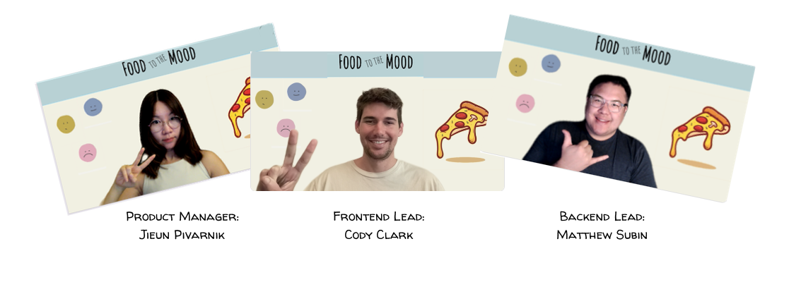
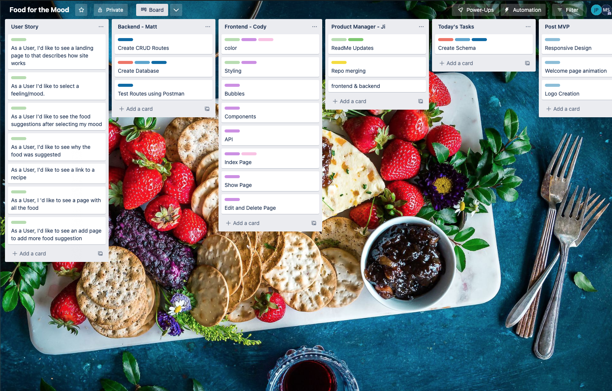
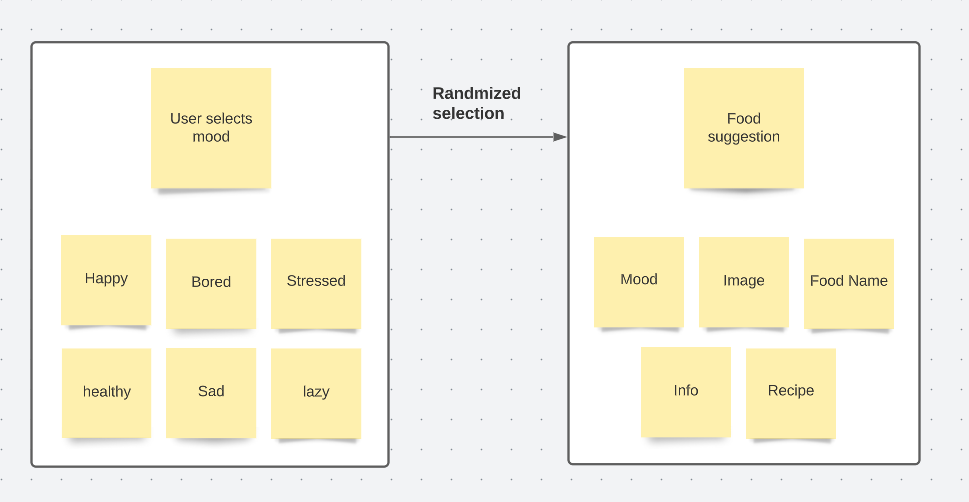
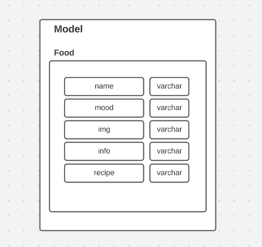
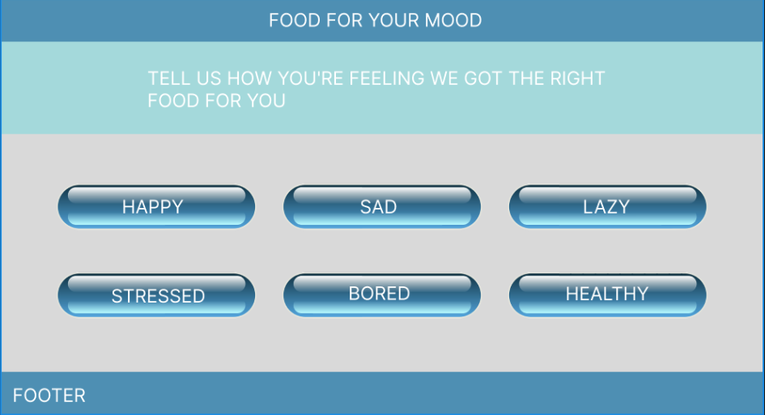
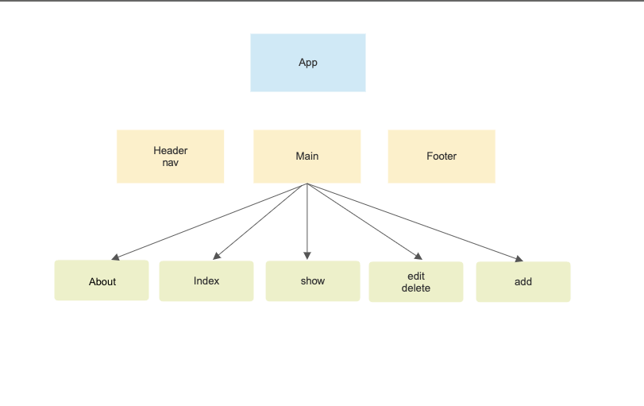
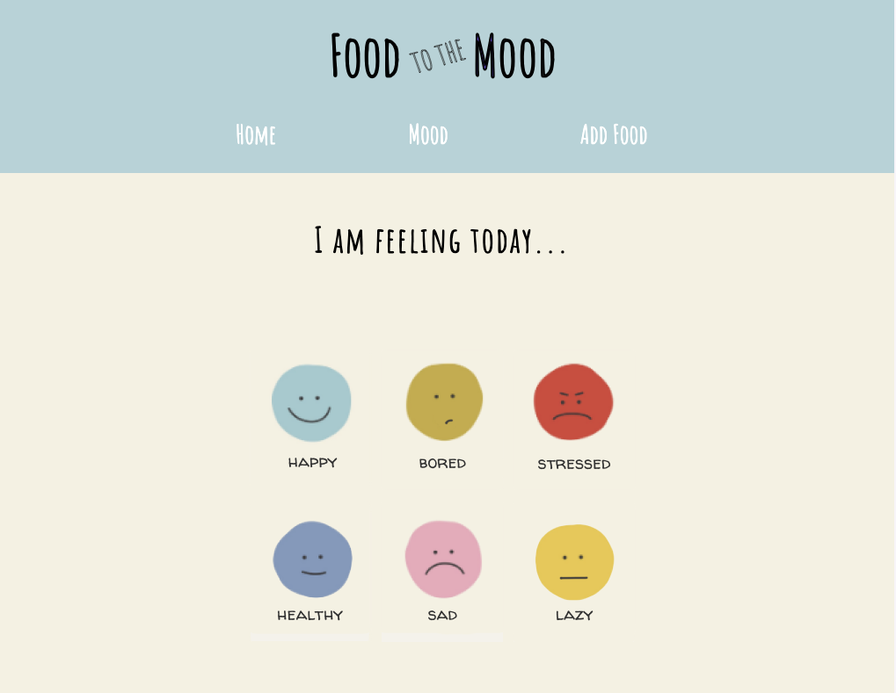
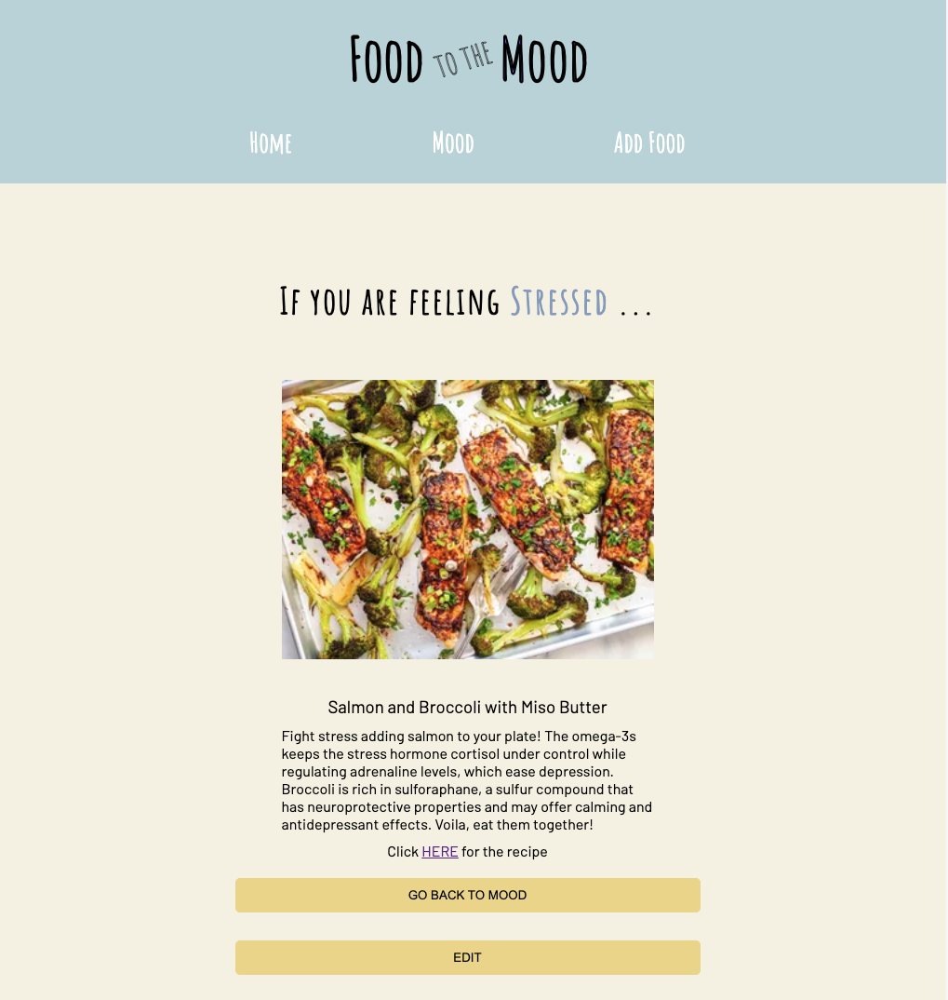

# Food to the Mood

Food to the Mood is an app to provide food suggestions to users to boost their mood. 

## Team 

## Repo

#### Frontend: [https://github.com/Jibelais/food-for-the-mood-frontend](https://github.com/Jibelais/food-for-the-mood-frontend)
#### Backend: [https://github.com/SlowLifeMatt/django-food-mood-backend](https://github.com/SlowLifeMatt/django-food-mood-backend)

## User Stories

* As a User I'd like to select a feeling/mood.
* As a User I'd like to see the food suggestions after selecting my mood.
* As a User, I'd like to see why the food was suggested
* As a User, I'd like to see a link to a recipe
* As a User, I 'd like to see  a page with all the food

#
## Trello board
[https://trello.com/b/v6KTdRo0/food-for-the-mood](https://trello.com/b/v6KTdRo0/food-for-the-mood)

## Page flow

## Model

## Wireframe 

## App diagram

## Interface

### Technologies Used

* Django
* React
* Node
* Full CRUD

## Live link
[https://main--food-to-the-mood.netlify.app/](https://main--food-to-the-mood.netlify.app/)

## Future Enhancement 

* Model relationship between mood and food 
* Admin feature
* Add more data to avoid repeating suggestion

